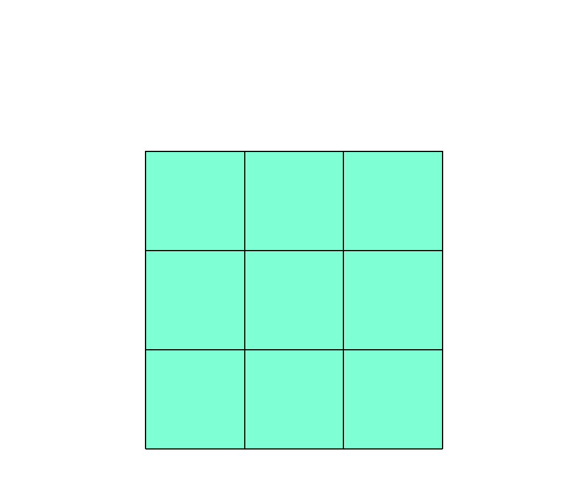
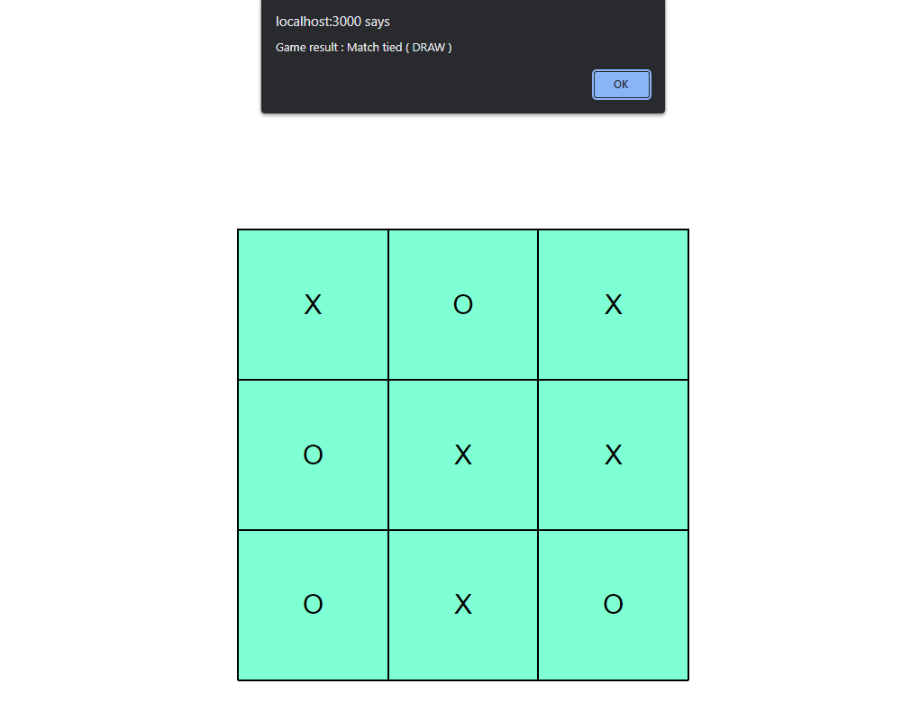

# Tic-Tac-Toe

A two-player Tic-Tac-Toe game built with React. Both players take turns on the same screen, clicking squares on a 3x3 board. The game detects wins and draws, shows the result in a browser alert, and then resets the board for a new round.

This project was bootstrapped with [Create React App](https://github.com/facebook/create-react-app).

## Features

- 3x3 board rendered with a reusable `Square` component
- Local two-player mode: players alternate between X and O (X moves first)
- Occupied squares cannot be overwritten
- Win detection across all 8 lines (3 rows, 3 columns, 2 diagonals)
- Draw detection when the board is full
- Result shown in a browser alert (for example `Game result : X Won`), after which the board resets automatically

## Tech Stack

- React 18 (`react`, `react-dom`)
- Create React App (`react-scripts` 5.0.1)
- Plain CSS for styling

## Project Structure

```
Tic-Tac-Toe/
├── public/                 # HTML template, favicon, manifest
├── src/
│   ├── Components/
│   │   └── Square.js       # Single clickable board cell
│   ├── App.js              # Game state, turn handling, win/draw checks
│   ├── App.css             # Board and square styles
│   ├── Patterns.js         # The 8 winning index combinations
│   └── index.js            # React entry point
├── restart.png, winner.png, draw.png   # Screenshots used below
└── package.json
```

## Prerequisites

- [Node.js](https://nodejs.org/) with npm

## Installation

```bash
git clone https://github.com/iSouvikKhan/Tic-Tac-Toe.git
cd Tic-Tac-Toe
npm install
```

## Running the App

```bash
npm start
```

Runs the app in development mode. Open [http://localhost:3000](http://localhost:3000) in your browser. The page reloads when you make changes.

### Other scripts

- `npm run build` - creates an optimized production build in the `build` folder.
- `npm test` - starts the Create React App test runner in watch mode (the project currently has no test files).
- `npm run eject` - copies the Create React App build configuration into the project. This is a one-way operation.

See the [Create React App documentation](https://facebook.github.io/create-react-app/docs/getting-started) for more details.

## How to Play

1. Click any empty square to place the current player's mark. X goes first, then players alternate.
2. Get three of your marks in a row, column, or diagonal to win.
3. If all nine squares fill up without a winner, the game is a draw.
4. After the result alert is dismissed, the board is cleared and a new game starts.

## Game Interface

### Game restarted



### Winner


### Match Draw


